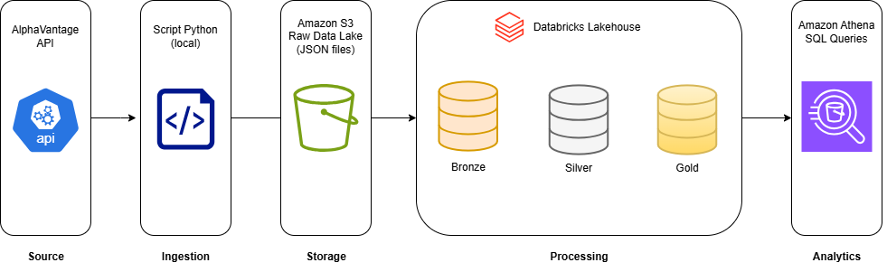

# Financial Market Data Lakehouse

# Arquitetura

O pipeline coleta dados da API Alpha Vantage utilizando um script Python,
armazenando os dados brutos no Amazon S3 (raw data lake).

O processamento é realizado no Databricks utilizando a arquitetura
Medallion (Bronze, Silver, Gold), gerando tabelas Delta para análise.

A camada analítica final é exportada para o S3 e disponibilizada para
consulta através do Amazon Athena.

---

# Tecnologias Utilizadas

- Python
- PySpark
- Databricks
- Delta Lake
- AWS S3
- SQL
- GitHub
- Amazon Athena

---

# Camadas do Pipeline

## Bronze Layer
Responsável por transformar os dados brutos da API em uma estrutura tabular.

Transformações:
- parsing do JSON da API
- extração das séries temporais
- conversão de tipos de dados
- padronização de datas
- inclusão de metadados de ingestão

Tabela gerada:
financial_market.bronze.alpha_vantage_daily

---

## Silver Layer
Responsável pela limpeza e padronização dos dados.

Transformações:
- remoção de duplicatas
- validação de dados nulos
- filtragem de preços inválidos
- cálculo de retorno diário
- cálculo da amplitude de preço

Tabela gerada:
financial_market.silver.alpha_vantage_daily_clean

---

## Gold Layer
Camada analítica para consumo em dashboards e análises financeiras.

Métricas calculadas:

- média móvel de 7 dias
- média móvel de 30 dias
- volatilidade
- retorno acumulado
- ranking diário de ativos

Tabela gerada:
financial_market.gold.market_analytics

---

# Status do Projeto

- [x] Estrutura inicial criada
- [x] Bucket S3 criado
- [x] Data Lake organizado
- [x] Ingestão via API Alpha Vantage
- [x] Camada Bronze implementada
- [x] Camada Silver implementada
- [x] Camada Gold implementada
- [x] Orquestração com Databricks Jobs
- [ ] Dashboard analítico

